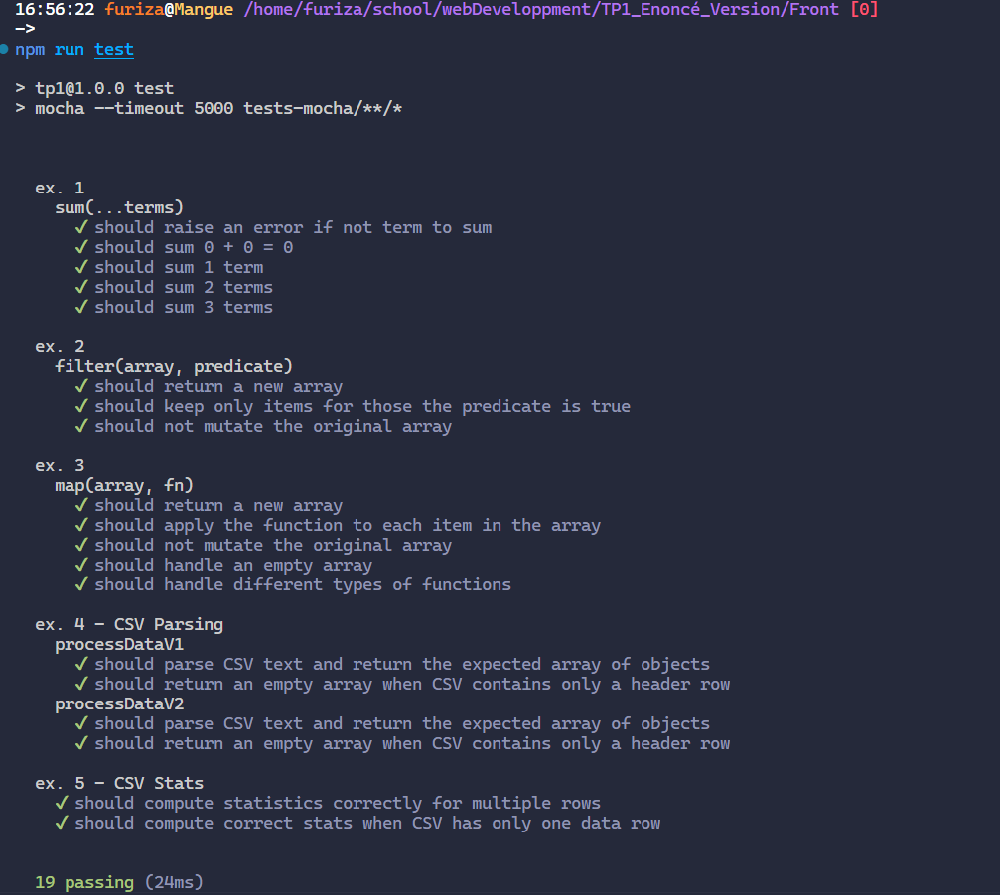

# Compte Rendu

**Nom** : Fouad Id Gouahmane - Hugo Wendjaneh \
**Date** : 16-02-2025 \
**Sujet** : Developpement web \
**Contexte** : Les bases de javascript

## 1. Objectif

L'objectif de ce TP est de se familiariser avec les bases de JavasScript en utilisant ou en reproduisant les fonctions natives de JavaScript.

## 2. Exercices

### Exercice 1

Créer une fonction qui permet de calculer la somme entre plusieurs nombres.

```javascript
const sumV1 = (...arr) => {
  if (arr.length === 0) throw new Error("At least one number is expected");
  return arr.reduce((acc, val) => acc + val, 0);
};

const sumV2 = (...arr) => {
  if (arr.length === 0) throw new Error("At least one number is expected");
  let result = 0;
  for (let i = 0; i < arr.length; i++) {
    result += arr[i];
  }
  return result;
};

export { sumV1 };
```

Dans cet exercice, plusieurs possibilités s'offrent à nous pour calculer la somme des nombres. Nous avons choisi d'utiliser la méthode `reduce`, permettant de réduire un tableau à une seule valeur, pour la première version. Une boucle `for` pour la deuxième version. Les `...` permettent de passer un nombre variable d'arguments à la fonction.

### Exercice 2

Créer une fonction qui permet de filtrer un tableau en fonction d'une condition donnée, une fonction qui retourne `true` ou `false` pour chaque élément du tableau.

```javascript
const filter = (arr, callback) => {
  const result = [];
  for (let i = 0; i < arr.length; i++) {
    if (callback(arr[i])) {
      result.push(arr[i]);
    }
  }
  return result;
};

const filterV2 = (arr, callback) => arr.filter(callback);

export { filter };
```

Dans cet exercice, plusieurs possibilités s'offrent à nous pour filtrer un tableau. Nous avons choisi d'utiliser une boucle `for` pour la première version. La méthode `filter` pour la deuxième version. La méthode `filter` permet de filtrer un tableau en fonction d'une condition donnée, une fonction qui retourne `true` ou `false` pour chaque élément du tableau.

## Exercice 3

Créer une fonction qui permet de mapper un tableau en appliquant une fonction donnée à chaque élément du tableau.

```javascript
const map = (arr, fn) => {
  const result = [];
  for (let i = 0; i < arr.length; i++) {
    result.push(fn(arr[i]));
  }
  return result;
};

const mapV2 = (arr, fn) => arr.map(fn);

export { map };
```

Dans cet exercice, plusieurs possibilités s'offrent à nous pour mapper un tableau. Nous avons choisi d'utiliser une boucle `for` pour la première version. La méthode `map` pour la deuxième version. La méthode `map` permet de mapper un tableau en appliquant une fonction donnée à chaque élément du tableau.

## Exercice 4 et 5

Dans un premier temps, nous avons créé une route `/data.csv` du côté serveur qui renvoie un fichier CSV, en utilisant Express.

```javascript
const express = require("express");
const path = require("path");
const app = express();
const port = 3000;

// Chemin vers le fichier CSV
const csvFilePath = path.join(__dirname, "./Data/data.csv");

// Route pour servir le fichier CSV
app.get("/data.csv", (req, res) => {
  res.sendFile(csvFilePath);
});

// Démarrage du serveur
app.listen(port, () => {
  console.log(`Serveur démarré sur http://localhost:${port}`);
});
```

Ensuite, nous avons implémenté deux versions de la fonction de traitement des données CSV :

```javascript
function processDataV1(csvText) {
  const result = [];
  const lines = csvText.trim().split("\n");
  for (let i = 1; i < lines.length; i++) {
    const values = lines[i].split(",");
    const obj = {
      username: values[0],
      realName: values[1],
      website: values[2] || null,
      projectName: values[3],
    };
    result.push(obj);
  }
  return result;
}

const processDataV2 = (csvText) => {
  return csvText
    .trim()
    .split("\n")
    .slice(1)
    .map((line) => line.split(","))
    .map((values) => ({
      username: values[0],
      realName: values[1],
      website: values[2] || null,
      projectName: values[3],
    }));
};
```

La première version (`processDataV1`) utilise une approche impérative avec une boucle for, tandis que la deuxième version (`processDataV2`) utilise une approche fonctionnelle avec les méthodes de tableau.

Pour l'exercice 5, nous avons créé une fonction `stats` qui calcule différentes statistiques sur les données :

- Le premier nom de projet par ordre alphabétique
- Le nombre de contributeurs uniques
- La longueur moyenne des noms
- Le contributeur le plus actif
- Les 10 projets les plus populaires

```javascript
function stats(csvText) {
  const data = processDataV2(csvText);

  const firstProjectName = [...new Set(data.map((d) => d.projectName))].sort(
    (a, b) => a.localeCompare(b, "en", { sensitivity: "base" })
  )[0];

  const uniqueContributors = [...new Set(data.map((d) => d.realName))].length;

  const uniqueNames = [...new Set(data.map((d) => d.realName))];
  const averageNameLength =
    uniqueNames.reduce((acc, name) => acc + name.length, 0) /
    uniqueNames.length;

  const contributorActivity = data.reduce((acc, d) => {
    acc[d.username] = (acc[d.username] || 0) + 1;
    return acc;
  }, {});
  const mostActiveContributor = Object.entries(contributorActivity).sort(
    (a, b) => b[1] - a[1]
  )[0][0];

  const projectContributions = data.reduce((acc, d) => {
    acc[d.projectName] = (acc[d.projectName] || 0) + 1;
    return acc;
  }, {});
  const top10Projects = Object.entries(projectContributions)
    .sort((a, b) => b[1] - a[1])
    .slice(0, 10)
    .map(([name]) => name);

  return {
    firstProjectName,
    uniqueContributors,
    averageNameLength,
    mostActiveContributor,
    top10Projects,
  };
}
```

Nous avons utilisé `fetch` pour récupérer le fichier CSV à partir de la route `/data.csv` et calculer les statistiques sur les données.

```javascript
fetch("http://localhost:3000/data.csv")
  .then((response) => response.text())
  .then(stats)
  .then(console.log)
  .catch(console.log);
```

Les tests unitaires ont été écrits avec Mocha et Chai pour vérifier le bon fonctionnement de ces fonctions dans différents scénarios.

```javascript
import { expect } from "chai";
import { processDataV1, processDataV2, stats } from "../src/exo4-exo5.js";

const sampleCSV = `
username,realName,website,projectName
alice,Alice Wonderland,www.alice.com,Alpha
bob,Bob Builder,,Beta
charlie,Charlie Chaplin,www.charlie.com,Alpha
dave,David Copperfield,,Gamma
alice,Alice Wonderland,www.alice.com,Beta
bob,Bob Builder,,Alpha
alice,Alice Wonderland,www.alice.com,Alpha
`;

const expectedData = [
  {
    username: "alice",
    realName: "Alice Wonderland",
    website: "www.alice.com",
    projectName: "Alpha",
  },
  {
    username: "bob",
    realName: "Bob Builder",
    website: null,
    projectName: "Beta",
  },
  {
    username: "charlie",
    realName: "Charlie Chaplin",
    website: "www.charlie.com",
    projectName: "Alpha",
  },
  {
    username: "dave",
    realName: "David Copperfield",
    website: null,
    projectName: "Gamma",
  },
  {
    username: "alice",
    realName: "Alice Wonderland",
    website: "www.alice.com",
    projectName: "Beta",
  },
  {
    username: "bob",
    realName: "Bob Builder",
    website: null,
    projectName: "Alpha",
  },
  {
    username: "alice",
    realName: "Alice Wonderland",
    website: "www.alice.com",
    projectName: "Alpha",
  },
];

describe("ex. 4 CSV Parsing", function () {
  const implementations = [
    { name: "processDataV1", func: processDataV1 },
    { name: "processDataV2", func: processDataV2 },
  ];

  implementations.forEach(({ name, func }) => {
    describe(name, function () {
      it("should parse CSV text and return the expected array of objects", function () {
        const result = func(sampleCSV);
        expect(result).to.deep.equal(expectedData);
      });

      it("should return an empty array when CSV contains only a header row", function () {
        const headerOnly = "username,realName,website,projectName";
        const result = func(headerOnly);
        expect(result).to.deep.equal([]);
      });
    });
  });
});

describe("ex. 5 - CSV Stats", function () {
  it("should compute statistics correctly for multiple rows", function () {
    const result = stats(sampleCSV);
    expect(result).to.be.an("object");
    expect(result.firstProjectName).to.equal("Alpha");
    expect(result.uniqueContributors).to.equal(4);
    expect(result.averageNameLength).to.equal(14.75);
    expect(result.mostActiveContributor).to.equal("alice");
    expect(result.top10Projects).to.deep.equal(["Alpha", "Beta", "Gamma"]);
  });

  it("should compute correct stats when CSV has only one data row", function () {
    const singleRowCSV = `
username,realName,website,projectName
john,John Doe,www.johndoe.com,ProjectX
    `;
    const result = stats(singleRowCSV);
    expect(result.firstProjectName).to.equal("ProjectX");
    expect(result.uniqueContributors).to.equal(1);
    expect(result.averageNameLength).to.equal("John Doe".length);
    expect(result.mostActiveContributor).to.equal("john");
    expect(result.top10Projects).to.deep.equal(["ProjectX"]);
  });
});
```



## Conclusion

Ce TP nous a permis de nous familiariser avec les bases de JavaScript en utilisant ou en reproduisant les fonctions natives de JavaScript. Nous avons appris à manipuler des tableaux, des objets, des chaînes de caractères, et à écrire des fonctions pour traiter des données CSV. Nous avons également appris à écrire des tests unitaires avec Mocha et Chai pour vérifier le bon fonctionnement de nos fonctions.
