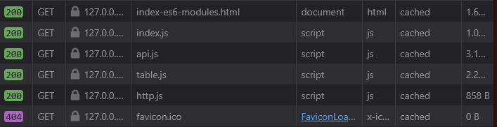
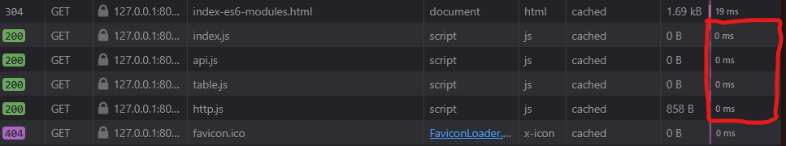

# Compte Rendu

**Nom** : Hugo Wendjaneh
**Date** : 07-03-2025
**Sujet** : Développement web

## 1. Objectif

Expliquer ici l'objectif principal du compte rendu.
Exemple : "Analyser les résultats du TP", "Faire le point sur l'avancement du projet", "Discuter des décisions prises en réunion".

## 2. Contexte et Informations Initiales

Décrire le contexte dans lequel ce compte rendu a été rédigé.
Exemple : "Ce compte rendu résume les travaux effectués durant le TP sur les circuits électriques."
Exemple : "Réunion concernant l'organisation du projet X."

---

## 3. Exercices

### 3.1. Exercice 1

L'érreur dans la console du navigateur est un fichier non trouvé (error 404). En effet le serveur n'arrive pas à trouver le fichier favicon.ico qui est l'icone du site web qui va s'afficher dans le navigateur.

```
GET
http://127.0.0.1:8080/favicon.ico
[HTTP/1.1 404 Not Found 0ms]
```


### 3.2 Exercice 2

Le nombre de fichiers javascript chargés par le navigateur est de 4.



En moyonne le temps de chargement d'un fichiers javascript ES6-module est de 0ms.



Le temps de chargement de tous les fichiers javascript est de 0ms.


Le navigateur télécharge les fichiers javascript en parallèle.

### 3.3 Exercice 3

Le

### 3.2. Sujet ou Étape 2

Détailler le deuxième sujet ou étape.
Exemple : "Mesure des tensions", "Analyse des données", "Définition des tâches pour l'équipe".

## 4. Résultats ou Décisions

### 4.1. Résultats Obtenus (ou Décisions Prises)

- **Résultat/Decision 1** : Décrire le résultat ou la décision.
- **Résultat/Decision 2** : Décrire le résultat ou la décision.

### 4.2. Analyse des Résultats / Impacts des Décisions

Analyser les résultats obtenus ou les décisions prises.  
Exemple : "Les mesures sont cohérentes avec la théorie", "La décision d’allouer plus de ressources permettra d’avancer plus rapidement."

## 5. Problèmes et Solutions

### 5.1. Problèmes Identifiés

Lister les problèmes rencontrés ou les points bloquants.  
Exemple : "Erreur dans les mesures", "Problème de communication entre les membres de l'équipe".

### 5.2. Solutions Proposées

Présenter les solutions discutées ou adoptées pour résoudre les problèmes.  
Exemple : "Correction des connexions", "Révision du calendrier de projet."

## 6. Actions à Réaliser / Prochaines Étapes

| Action   | Responsable | Délai       | Statut             |
| -------- | ----------- | ----------- | ------------------ |
| Action 1 | Nom         | Date limite | En cours / Terminé |
| Action 2 | Nom         | Date limite | En cours / Terminé |

### 6.1. Prochaines Étapes

Décrire les prochaines étapes à suivre, que ce soit pour la suite du TP, du projet ou de la réunion.
Exemple : "Compléter l'analyse des données", "Préparer la prochaine réunion."

---

## 7. Observations ou Recommandations

Ajoute ici des observations générales ou des recommandations pour améliorer le processus, les méthodes ou les résultats.
Exemple : "Améliorer la précision des instruments", "Clarifier les rôles dans l'équipe pour plus d'efficacité."

## 8. Annexes et Références

Inclure ici des documents ou des informations complémentaires qui ont été utilisés ou sont nécessaires pour comprendre le compte rendu :

- Annexe 1 : [Lien vers le document externe]
- Annexe 2 : Schéma ou tableau récapitulatif (à insérer ici si applicable)

### Signature

Nom et titre : Hugo Wendjaneh
Date : 07-03-2025
