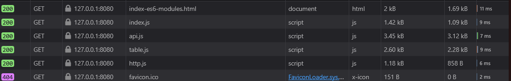
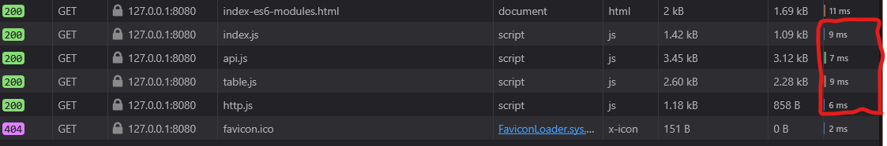

# Compte Rendu

**Nom** : Hugo Wendjaneh - Fouad Id Gouahmane - Charles Raymondière
**Date** : 07-03-2025
**Sujet** : Développement web

---

## 3. Exercices

### 3.1. Exercice 1

L'érreur dans la console du navigateur est un fichier non trouvé (error 404). En effet le serveur n'arrive pas à trouver le fichier favicon.ico qui est l'icone du site web qui va s'afficher dans le navigateur.

```
GET
http://127.0.0.1:8080/favicon.ico
[HTTP/1.1 404 Not Found 0ms]
```


### 3.2 Exercice 2

Le nombre de fichiers javascript chargés par le navigateur est de 4.



En moyonne le temps de chargement d'un fichiers en moyenne javascript ES6-module est de 8ms.



Le temps de chargement de tous les fichiers javascript est de 31ms.


Le navigateur télécharge les fichiers javascript en parallèle.

### 3.3 Exercice 3

Servir les fichiers javascript ES6-modules de manière indépendante, comparé à les servir en un seul fichier peut causer des problèmes, notamment la multiplication des requêtes HTTP. En effet chaque module importé nécessite une requête HTTP pour être chargé. Cela peut ralentir le chargement de la page web.

### 3.4 Exercice 4

D'autre dépendance node_modules sont ajouté, car chaque module peut utiliser d'autre dépendance. Celle ci sont donc ajouté et téléchargé dans le dossier node_modules. C'est donc un arbre de dépendance qui se forme.

### 3.5 Exercice 5

Le projet front n'a pas de vulnérabilité de sécurité dans les nodes modules.
Pour répondre à cette question, j'ai installé les dépendances via `npm install`. Puis, par la suite,
j'ai utilisé la commande `npm audit` pour vérifier les vulnérabilités de sécurité dans les dépendances du projet.


### 3.6 Exercice 6

Sur la documentation de webpack nous pouvons lire que pour régler les problèmes de performance il faut `build` le projet. En effet, webpack va optimiser le code en supprimant les commentaires, les espaces inutiles et en minifiant le code. Cela va réduire la taille du fichier javascript et donc améliorer les performances de l'application, notament au niveaux du temps de chargement.

Pour cela, lors du build nous devons modifier le fichier `package.json` pour que webpack puisse créer un fichier de production. Il faut donc ajouter la commande `webpack --mode production` dans le script `build` du fichier `package.json`.

```json
{
  "scripts": {
    "build": "webpack --mode production"
  }
}
```


### 3.7 Exercice 7

Nous devons lancer le build en exécutant la commande `npm run build`. Cela va créer un dossier `dist` qui contiendra le fichier javascript minifié et optimisé. Il faut ensuite ouvrir le fichier `index.html` dans le dossier `dist` pour voir le résultat.


### 3.8 Exercice 8

Performance du fichier `index-es6-modules.html` :


Performance du fichier `index-bundle.html`, build avec webpack :


### 3.9 Exercice 9

La différence est que tout le code javascript est dans un seul fichier. Cela permet de réduire le nombre de requêtes HTTP et donc d'améliorer les performances de l'application. De plus, le code est minifié et optimisé, ce qui réduit la taille du fichier javascript et donc le temps de chargement de la page web.

Code javascript avant minification :


Code avec webpack :


### 3.10 Exercice 10

Internet explorer n'arrive pas a charger le fichier javascript car il ne supporte pas les modules ES6. Notament l'utilisation `=>` qui n'est pas supporté par Internet explorer :


### 3.11 Exercice 11

Non, ce n'est pas suffisant pour garantir la compatibilité avec Internet Explorer 11. En effet Babel gère la syntaxe JavaScript mais pas nécessairement les APIs JavaScript du navigateur. Pour assurer une compatibilité complète avec IE11, il est nécessaire d'ajouter explicitement des polyfills pour ces APIs manquantes.

### 3.12 Exercice 12

Aprés avoir importer les polyfills à partir de core-je et whatwg-fetch dans un fichier index.js. L'application fonctionne:


### 3.13 Exercice 13

Le code transpilé vers ES5 peut être moins performant que le code moderne natif exécuté sur les navigateurs récents. Certaines fonctionnalités (par exemple, async/await) peuvent être significativement plus lentes après transpilation à cause de la complexité ajoutée par Babel pour émuler ces comportements.

Le problème de performance est que Babel doit ajouter du code supplémentaire pour émuler certaines fonctionnalités modernes qui ne sont pas présentes dans ES5. Par exemple, les fonctions fléchées sont transformées en fonctions normales, ce qui peut entraîner une légère surcharge de performance. De plus, certaines optimisations que le moteur JavaScript moderne pourrait appliquer au code natif ne peuvent pas être appliquées au code transpilé. De plus, le fichier envoié au navigateur est plus lourd, ce qui peut ralentir le temps de chargement de la page web.

Pour résoudre ce problème, il est possible de target un environnement spécifique lors de la transpilation. Par exemple, en utilisant la configuration suivante dans le fichier .babelrc :

```json
{
  "presets": [
    [
      "@babel/preset-env",
      {
        "targets": {
          "useBuiltIns": "usage",
          "corejs": 3,
          "browsers": [
            "> 0.25%",
            "not dead",
            {
              "ie": "11"
            }
          ]
        }
      }
    ]
  ]
}
```

Cela permet de cibler uniquement les navigateurs modernes et d'éviter de transpiler le code pour des environnements plus anciens, ce qui peut améliorer les performances. De plus, il est possible d'utiliser des outils comme Webpack pour optimiser le code final en supprimant les parties inutiles et en minifiant le code.
