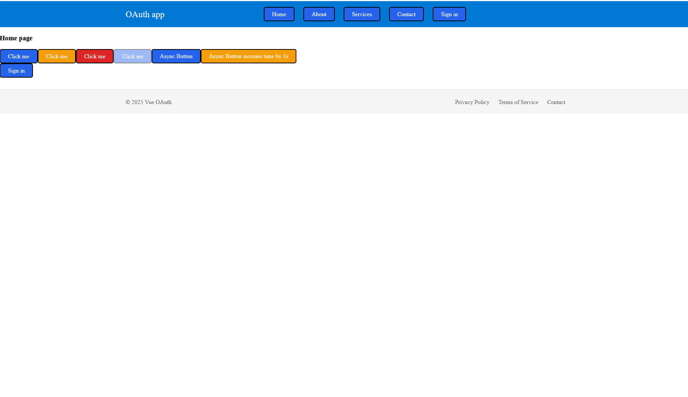

# Compte Rendu

**Nom** : Hugo Wendjaneh – Fouad Id Gouahmane – Charles Raymondière  
**Date** : 07-03-2025  
**Sujet** : Développement web

---

## Question 1 : Pourquoi ne pas committer des credentials dans Git ?

- **Risque de fuite involontaire** : un dépôt Git peut être public, partagé entre plusieurs collaborateurs ou même publié (GitHub, GitLab…). Tous ceux qui cloneraient l’historique pourraient récupérer vos secrets.
- **Impossible à supprimer complètement** : même si vous retirez un secret d’un commit ultérieur, il reste dans l’historique et peut être récupéré.
- **Exposition aux attaques** : un attaquant ayant accès à ces credentials (API keys, identifiants OAuth…) peut usurper votre application, lire ou modifier des données sensibles, voire faire des actions en votre nom.
- **Conformité & audit** : la plupart des réglementations interdisent le stockage de secrets en clair dans un SCM.

---

## Question 2 : Pourquoi avoir des configurations différentes selon l’environnement ? Donnez un exemple.

- **Séparation des contextes** : on veut différencier _développement_, _test_, _préproduction_ et _production_ (URL d’API, clés OAuth, endpoints, niveaux de log…).
- **Exemple concret** :
  - En **dev** :
    ```bash
    VUE_APP_API_URL=http://localhost:3000
    VUE_APP_OAUTH_CLIENT_ID=dev-client-id
    ```
  - En **prod** :
    ```bash
    VUE_APP_API_URL=https://api.mondomaine.com
    VUE_APP_OAUTH_CLIENT_ID=prod-client-id
    ```
  - Ainsi, on pointe vers un serveur local en dev et vers l’API réelle en prod, sans changer le code et sans exposer les credentials de production aux développeurs.

---

## Question 3 : Problèmes de maintenabilité avec props & events

1. **Prop drilling** : chaque composant intermédiaire doit déclarer et transmettre une prop qu’il n’utilise pas lui-même.
2. **Boilerplate important** : déclarations répétitives de props, d’événements, de listeners, ce qui alourdit le code.
3. **Couplage fort** : la structure du component tree conditionne le passage des données, difficile à refactorer.
4. **Performance** : un changement de prop en haut de l’arbre provoque des re-renderings de tous les composants descendants, même ceux qui n’ont pas besoin de la donnée.
5. **Suivi du flux de données** : pour comprendre d’où vient une valeur ou où part un événement, il faut remonter tout le chainage props → events.

---

## Question 4 : Quel est le bug si l’inject n’est pas réactif ?

- Par défaut, `provide()` injecte une référence statique : si la valeur fournie change, les composants enfants ne sont **pas** notifiés et ne se rerendent pas.
- **Conséquence pratique** : après authentification, le store `user` mis à jour dans le composant parent n’est pas propagé aux consommateurs injectés.
- **Solution** : fournir un objet `reactive({ … })` ou un `ref` via `provide('user', reactive(...))`, ou exposer un setter pour déclencher la réactivité.

---

## Question 5 : Comparaison des stratégies de gestion d’état

| Stratégie                | Avantages                                                                       | Inconvénients                                                                                         |
| ------------------------ | ------------------------------------------------------------------------------- | ----------------------------------------------------------------------------------------------------- |
| **Props & Events**       | – Aucune dépendance externe<br>– Flux de données explicite                      | – Prop drilling<br>– Boilerplate<br>– Coupure difficile en profondeur                                 |
| **Provide & Inject**     | – Évite le prop drilling<br>– Très simple à mettre en place                     | – Injection peu explicite (moindre lisibilité)<br>– Non réactif si mal utilisé                        |
| **Store (Vuex / Pinia)** | – État global centralisé et réactif<br>– Devtools dédiés<br>– Modules / plugins | – Configuration initiale<br>– Boilerplate pour mutations/actions<br>– Couplage fort à la bibliothèque |

> **Remarque** : on peut aussi envisager la **Composition API** (composables) ou même le **Context API** (dans Vue 3) pour des cas intermédiaires.

---

## Question 6 : Faut-il gérer tout l’état exclusivement avec un store ?

- **Arguments pour**
  - Simplification du partage d’état global (pas de prop drilling).
  - Outils de débogage et de time-travel (devtools Vuex/Pinia).
- **Arguments contre**
  - **Surcharge inutile** pour de petits états locaux (formulaires, UI éphémère).
  - Perte d’**encapsulation** et de **prévisibilité** de certains composants (ils deviennent moins « autonomes »).
  - Couplage fort à une bibliothèque externe, complexité pour l’onboarding.
- **Position équilibrée** :
  - Utiliser un store pour l’état **vraiment global** et partagé par de multiples parties de l’app.
  - Conserver props/events ou provide/inject pour les états plus locaux ou liés à une fonctionnalité restreinte.

---

## Question 7 : Différence de performance entre `<a href="/conversations">…</a>` et `<router-link to="/conversations">…</router-link>`

| Lien HTML natif (`<a>`)              | `<router-link>` (vue-router)                                     |
| ------------------------------------ | ---------------------------------------------------------------- |
| • **Full page reload**               | • **Navigation client-side** (pas de rechargement complet)       |
| • Requête HTTP vers le serveur       | • Utilise History API, vue-router gère la route en mémoire       |
| • Plus lent et coûteux en ressources | • Très rapide, conserve l’état JS, animations, transition fluide |
| • Moins intégré à l’écosystème SPA   | • Permet styles actifs, guards, lazy-loading des composants      |

---

## Grandes étapes du TP

### Étape 1 – HomePage avant authentification



### Étape 2 – Popup OAuth “Pick an account”


### Étape 3 – HomePage après authentification


### Étape 4 – Liste des conversations récentes


### Étape 5 – Détail d’une conversation


